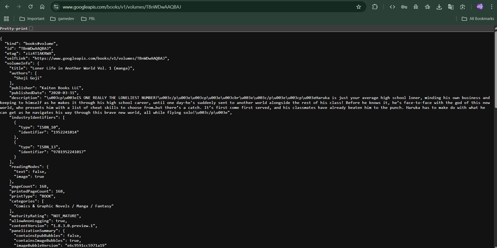

# Praktikum 11 - Books App
## Mengunduh Data dari Web Service (API)

**Nama:** Katana  
**NIM:** [Your NIM]

---

## Praktikum 1: Mengunduh Data dari Web Service (API)

### Langkah 1: Buat Project Baru
✅ Project Flutter dengan nama `books` telah dibuat di folder `week11`

Menambahkan dependensi http:
```bash
flutter pub add http
```

### Langkah 2: Cek file pubspec.yaml
✅ Plugin http berhasil ditambahkan ke `pubspec.yaml`

```yaml
dependencies:
  flutter:
    sdk: flutter
  cupertino_icons: ^1.0.8
  http: ^1.6.0
```

### Langkah 3: Buka file main.dart

#### Soal 1


```dart
return MaterialApp(
  title: 'Back from the Future - Charel',
  theme: ThemeData(
    primarySwatch: Colors.blue,
    visualDensity: VisualDensity.adaptivePlatformDensity,
  ),
  home: const FuturePage(),
);
```

### Langkah 4: Tambah method getData()

#### Soal 2
📚 **Buku Favorit:** Loner Life in Another World Vol. 1 (manga)
- **Judul:** Loner Life in Another World Vol. 1 (manga)
- **Penulis:** Shoji Goji
- **ID Buku:** `TBnWDwAAQBAJ`

**URL API Google Books:**
```
https://www.googleapis.com/books/v1/volumes/TBnWDwAAQBAJ
```

**Screenshot JSON Response:**



*Catatan: Silakan akses URL di atas di browser untuk melihat response JSON lengkap dari Google Books API*

**Kode getData():**
```dart
Future<Response> getData() async {
  const authority = 'www.googleapis.com';
  const path = '/books/v1/volumes/TBnWDwAAQBAJ';
  Uri url = Uri.https(authority, path);
  return http.get(url);
}
```

### Langkah 5: Tambah kode di ElevatedButton

#### Soal 3

**Penjelasan kode:**

**1. `substring(0, 450)`:**
- Method `substring()` digunakan untuk mengambil sebagian string dari data JSON yang diterima
- Parameter `(0, 450)` berarti mengambil karakter dari indeks 0 sampai 450
- Ini dilakukan untuk membatasi jumlah data yang ditampilkan di layar agar tidak terlalu panjang dan memudahkan pembacaan
- Tanpa substring, seluruh response JSON (yang bisa sangat panjang) akan ditampilkan dan membuat UI tidak rapi

**2. `catchError()`:**
- Method `catchError()` adalah error handler untuk menangani exception yang mungkin terjadi saat melakukan HTTP request
- Jika terjadi error (misalnya: tidak ada koneksi internet, timeout, atau URL tidak valid), maka kode di dalam `catchError()` akan dijalankan
- Dalam kasus ini, jika terjadi error, variabel `result` akan diisi dengan string `'An error occurred'` dan `setState()` dipanggil untuk memperbarui UI
- Ini membuat aplikasi lebih robust dan user-friendly karena memberikan feedback yang jelas ketika terjadi kesalahan

**Kode lengkap ElevatedButton:**
```dart
ElevatedButton(
  child: const Text('GO!'),
  onPressed: () {
    setState(() {});
    getData().then((value) {
      result = value.body.toString().substring(0, 450);
      setState(() {});
    }).catchError((_) {
      result = 'An error occurred';
      setState(() {});
    });
  },
),
```

**Hasil Praktikum:**


## Praktikum 2: Menggunakan await/async untuk menghindari callbacks

### Langkah 1: Buka file main.dart
Tambahkan tiga method berisi kode async di dalam class `_FuturePageState`:

```dart
Future<int> returnOneAsync() async {
  await Future.delayed(const Duration(seconds: 3));
  return 1;
}

Future<int> returnTwoAsync() async {
  await Future.delayed(const Duration(seconds: 3));
  return 2;
}

Future<int> returnThreeAsync() async {
  await Future.delayed(const Duration(seconds: 3));
  return 3;
}
```

### Langkah 2: Tambah method count()
Tambahkan method `count()` untuk menjumlahkan hasil dari ketiga method async:

```dart
Future count() async {
  int total = 0;
  total = await returnOneAsync();
  total += await returnTwoAsync();
  total += await returnThreeAsync();
  setState(() {
    result = total.toString();
  });
}
```

### Langkah 3: Panggil count()
Update kode `onPressed()` pada ElevatedButton:

```dart
ElevatedButton(
  child: const Text('GO!'),
  onPressed: () {
    count();
  },
),
```

### Langkah 4: Run
Aplikasi akan menampilkan angka 6 setelah delay 9 detik.

#### Soal 4

**Penjelasan Maksud Kode Langkah 1 dan 2:**

**Langkah 1 - Tiga Method Async:**
- `returnOneAsync()`, `returnTwoAsync()`, dan `returnThreeAsync()` adalah method asynchronous yang mengembalikan nilai `Future<int>`
- Setiap method menggunakan `await Future.delayed(const Duration(seconds: 3))` untuk mensimulasikan operasi yang membutuhkan waktu 3 detik (misalnya: mengambil data dari server)
- Keyword `async` menandai bahwa method ini adalah asynchronous dan dapat menggunakan `await` di dalamnya
- Setelah delay 3 detik, masing-masing method mengembalikan nilai integer (1, 2, dan 3)

**Langkah 2 - Method count():**
- Method `count()` adalah method async yang menunggu hasil dari ketiga method di atas secara berurutan
- Keyword `await` memaksa eksekusi untuk menunggu sampai method selesai sebelum melanjutkan ke baris berikutnya
- Proses berjalan berurutan:
  1. Tunggu 3 detik → dapat nilai 1
  2. Tunggu 3 detik lagi → dapat nilai 2, total = 1 + 2 = 3
  3. Tunggu 3 detik lagi → dapat nilai 3, total = 3 + 3 = 6
- Total waktu: 3 + 3 + 3 = 9 detik
- Setelah semua selesai, `setState()` dipanggil untuk memperbarui UI dengan hasil total (6)

**Perbedaan dengan Praktikum 1:**
- Praktikum 1 menggunakan `.then()` dan callback (lebih kompleks dan sulit dibaca)
- Praktikum 2 menggunakan `async/await` (lebih clean, mudah dibaca seperti kode synchronous)

**Hasil Praktikum:**


---

## Praktikum 3: Menggunakan Completer di Future

### Langkah 1: Buka main.dart
Pastikan telah impor package async berikut:

```dart
import 'package:async/async.dart';
```

**Catatan:** Untuk praktikum ini, `Completer` sudah tersedia di `dart:async` yang sudah diimpor sebelumnya, jadi tidak perlu menambahkan package `async` secara terpisah.

### Langkah 2: Tambahkan variabel dan method
Tambahkan variabel late dan method di class `_FuturePageState`:

```dart
late Completer completer;

Future getNumber() {
  completer = Completer<int>();
  calculate();
  return completer.future;
}

Future calculate() async {
  await Future.delayed(const Duration(seconds: 5));
  completer.complete(42);
}
```

### Langkah 3: Ganti isi kode onPressed()
Tambahkan kode berikut pada fungsi `onPressed()`:

```dart
ElevatedButton(
  child: const Text('GO!'),
  onPressed: () {
    getNumber().then((value) {
      setState(() {
        result = value.toString();
      });
    });
  },
),
```

### Langkah 4: Run
Aplikasi akan menampilkan angka 42 setelah delay 5 detik.

#### Soal 5

**Penjelasan Maksud Kode Langkah 2:**

**1. Variabel `late Completer completer;`:**
- Mendeklarasikan variabel `completer` dengan tipe `Completer` menggunakan keyword `late`
- `late` berarti variabel ini akan diinisialisasi nanti (bukan saat deklarasi), tetapi pasti akan diinisialisasi sebelum digunakan
- `Completer` adalah class yang digunakan untuk membuat dan mengontrol Future secara manual

**2. Method `getNumber()`:**
- Method ini membuat instance baru dari `Completer<int>()` yang akan menghasilkan Future dengan nilai integer
- `calculate()` dipanggil untuk memulai proses asynchronous
- `return completer.future` mengembalikan Future yang akan selesai nanti ketika `completer.complete()` dipanggil
- Method ini tidak menggunakan `async` karena langsung mengembalikan Future dari completer

**3. Method `calculate()`:**
- Method async yang mensimulasikan operasi yang memakan waktu 5 detik dengan `Future.delayed()`
- Setelah 5 detik, `completer.complete(42)` dipanggil untuk menyelesaikan Future dengan nilai 42
- Ketika `complete()` dipanggil, semua listener yang menunggu Future tersebut (seperti `.then()` di `onPressed()`) akan menerima nilai 42

**Cara Kerja Completer:**
1. `getNumber()` membuat Completer dan mengembalikan Future-nya
2. `calculate()` berjalan di background, menunggu 5 detik
3. Setelah 5 detik, `completer.complete(42)` "menyelesaikan" Future dengan nilai 42
4. `.then()` di `onPressed()` menerima nilai 42 dan mengupdate UI

**Keuntungan Completer:**
- Memberikan kontrol penuh kapan dan bagaimana Future diselesaikan
- Berguna untuk operasi asynchronous yang kompleks atau event-based
- Memisahkan logika pembuatan Future dengan logika penyelesaiannya

**Hasil Praktikum:**


