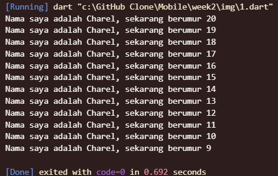
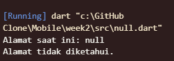
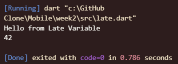

# Pemrograman Dart
## Soal 1
Modifikasilah kode pada baris 3 di VS Code atau Editor Code favorit Anda berikut ini agar mendapatkan keluaran (output) sesuai yang diminta!
```dart
void main(){
  for (int i = 0; i < 10>; i++) {
    print('hello ${i + 2}');
  }
}
```

Output yang diminta (Gantilah Fulan dengan nama Anda):
```
Nama Saya adalah Fulan Sekarang berumur 18
Nama Saya adalah Fulan Sekarang berumur 17
Nama Saya adalah Fulan Sekarang berumur 16
Nama Saya adalah Fulan Sekarang berumur 15
Nama Saya adalah Fulan Sekarang berumur 14
Nama Saya adalah Fulan Sekarang berumur 13
Nama Saya adalah Fulan Sekarang berumur 12
Nama Saya adalah Fulan Sekarang berumur 11
Nama Saya adalah Fulan Sekarang berumur 10
Nama Saya adalah Fulan Sekarang berumur 9
```
### Jawaban
``` dart
void main() {
   for (int i = 21; i > 9 ; i--) {
    print('Nama saya adalah Charel, sekarang berumur ${i - 1}');
  }
}
```
### Output


## Soal 2
Mengapa sangat penting untuk memahami bahasa pemrograman Dart sebelum kita menggunakan framework Flutter ? Jelaskan!
### Jawaban
Memahami bahasa pemrograman Dart adalah syarat fundamental sebelum menggunakan framework Flutter. Alasannya sederhana: Flutter dibangun di atas Dart. Analogi yang tepat adalah mustahil untuk menulis sebuah karya sastra dalam bahasa Prancis (Flutter) tanpa menguasai tata bahasa dan kosa kata bahasa Prancis itu sendiri (Dart).

Setiap aspek dalam Flutter—mulai dari Widget yang membentuk antarmuka pengguna (UI), logika bisnis, hingga manajemen data (state management)—diimplementasikan sebagai kode Dart. Widget adalah sebuah class dalam Dart. Pesan kesalahan (error) yang muncul saat proses debugging juga merupakan error dari Dart. Dengan demikian, penguasaan Dart bukanlah sebuah pilihan, melainkan pondasi esensial untuk dapat membangun aplikasi yang solid, terstruktur, dan mudah untuk dipelihara.

## Soal 3
Rangkumlah materi dari codelab ini menjadi poin-poin penting yang dapat Anda gunakan untuk membantu proses pengembangan aplikasi mobile menggunakan framework Flutter.
### jawaban 
Cara Memulai  dart 
Evolusi atau Sejarah Dart
Cara Kerja Dart
Pengenalan Struktur Bahasa Dart

## Soal 4
Buatlah penjelasan dan contoh eksekusi kode tentang perbedaan Null Safety dan Late variabel !
 ### Null Safety 
Null Safety adalah fitur inti dalam Dart di mana, secara default, sebuah variabel tidak diizinkan untuk bernilai null (non-nullable). Tujuannya adalah untuk mencegah null reference error (kesalahan referensi nol) secara proaktif pada saat kompilasi (compile-time). Jika sebuah variabel memang dirancang untuk dapat menyimpan nilai null, developer harus mendeklarasikannya secara eksplisit dengan menambahkan tanda tanya (?) pada tipe datanya.

``` dart
  void main() {
  String? alamat;
  alamat = null;
  print("Alamat saat ini: $alamat");

  if (alamat != null) {
    print("Panjang alamat: ${alamat.length}");
  } else {
    print("Alamat tidak diketahui.");
  }
}
```
### Output


### Late
late adalah sebuah "kontrak" atau janji kepada compiler. Ini digunakan pada variabel non-nullable yang inisialisasinya (pemberian nilai awal) terpaksa ditunda. Dengan late, kita menjamin bahwa variabel tersebut pasti akan diinisialisasi sebelum diakses untuk pertama kali. Kasus penggunaan umumnya adalah untuk variabel yang nilainya bergantung pada proses asinkron atau inisialisasi kompleks lainnya.

``` dart
void main() {
  late String lateString;
  late int lateNumber;
  
  lateString = "Hello from Late Variable";
  lateNumber = 42;
  
  print(lateString); 
  print(lateNumber); 
}
```
### Output
