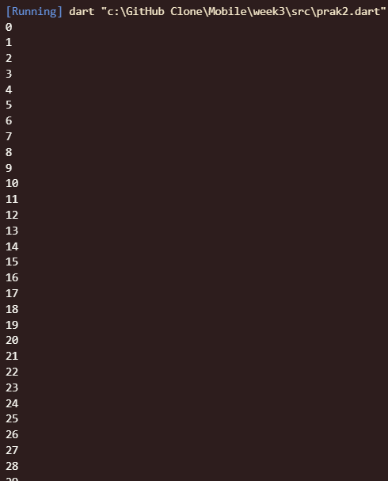

# Tugas Praktikum
## 1. Silakan selesaikan Praktikum 1 sampai 3, lalu dokumentasikan berupa screenshot hasil pekerjaan beserta penjelasannya!


## Praktikum 1: Menerapkan Control Flows ("if/else")
### Langkah 1:
Ketik atau salin kode program berikut ke dalam fungsi main().

```dart
String test = "test2";
if (test == "test1") {
   print("Test1");
} else If (test == "test2") {
   print("Test2");
} Else {
   print("Something else");
}

if (test == "test2") print("Test2 again");
```
### Langkah 2:
Silakan coba eksekusi (Run) kode pada langkah 1 tersebut. Apa yang terjadi? Jelaskan!

#### Answer
Terjadi error karena Dart bersifat case-sensitive. Keyword yang benar adalah else if dan else (huruf kecil semua).


Kode akan berjalan tanpa error dan menghasilkan output berikut:

1. Kondisi pertama (test == "test1") bernilai false karena "test2" tidak sama dengan "test1".
2. Program melanjutkan ke kondisi else if (test == "test2"). Kondisi ini bernilai true, sehingga program mencetak "Test2".
3. Blok else terakhir akan dilewati.
4. Struktur if yang kedua (if (test == "test2")) juga dievaluasi. Karena bernilai true, maka program mencetak "Test2 again".

### Langkah 3:
Tambahkan kode program berikut, lalu coba eksekusi (Run) kode Anda.
```dart
String test = "true";
if (test) {
   print("Kebenaran");
}

```

#### Answer
Masalah: Error terjadi karena kondisi if membutuhkan nilai boolean (true/false), bukan String.

Perbaikan: Lakukan perbandingan eksplisit test == "true" untuk menghasilkan nilai boolean.

```dart
String test = "true";
if (test == "true") {
   print("Kebenaran");
} else {
   print("Bukan kebenaran");
}
```


1. Kondisi test == "true" akan dievaluasi. Karena nilai test adalah "true", maka perbandingan ini menghasilkan nilai boolean true.
2. Karena kondisi bernilai true, blok di dalam if dieksekusi, dan program mencetak "Kebenaran".

## Praktikum 2: Menerapkan Perulangan "while" dan "do-while"
### Langkah 1:
Ketik atau salin kode program berikut ke dalam fungsi main().
```dart
while (counter < 33) {
  print(counter);
  counter++;
}
```
## Langkah 2:
Silakan coba eksekusi (Run) kode pada langkah 1 tersebut. Apa yang terjadi? Jelaskan! Lalu perbaiki jika terjadi error.

#### Answer
Masalah: Error karena variabel counter digunakan tanpa dideklarasikan terlebih dahulu.

Perbaikan: Deklarasikan variabel counter dengan tipe int dan beri nilai awal.


1. Program memulai dengan counter = 0.
2. Kondisi counter < 33 (0 < 33) bernilai true, maka blok loop dieksekusi: print(0) lalu counter menjadi 1.
3. Proses ini berulang terus: print(1), counter jadi 2; print(2), counter jadi 3; ...
4. ...sampai ketika counter bernilai 32. Program akan print(32), lalu counter menjadi 33.
5. Pada iterasi berikutnya, kondisi counter < 33 (33 < 33) bernilai false, dan perulangan berhenti.

### Langkah 3:
Tambahkan kode program berikut, lalu coba eksekusi (Run) kode Anda.
```dart 
do {
  print(counter);
  counter++;
} while (counter < 77);
   ```
Apa yang terjadi ? Jika terjadi error, silakan perbaiki namun tetap menggunakan do-while.

#### Answer
Analisis: Kode berjalan normal. Loop do-while melanjutkan eksekusi dari nilai counter terakhir (yaitu 33). Loop ini akan berjalan setidaknya satu kali sebelum mengecek kondisi.

 
1. Program masuk ke loop do-while. Tanpa mengecek kondisi, blok kode langsung dieksekusi. Nilai counter saat ini adalah 33, jadi program print(33) dan counter menjadi 34.
2. Sekarang kondisi dicek: counter < 77 (34 < 77) bernilai true. Loop berlanjut.
3. Proses ini berulang: print(34), counter jadi 35; ...
4. ...sampai ketika counter bernilai 76. Program akan print(76), lalu counter menjadi 77.
5. Pada akhir iterasi ini, kondisi counter < 77 (77 < 77) bernilai false, dan perulangan berhenti.

## Praktikum 3: Menerapkan Perulangan "for" dan "break-continue"

### Langkah 1:
Ketik atau salin kode program berikut ke dalam fungsi main().
```dart
for (Index = 10; index < 27; index) {
  print(Index);
}
```
### Langkah 2:
Silakan coba eksekusi (Run) kode pada langkah 1 tersebut. Apa yang terjadi? Jelaskan! Lalu perbaiki jika terjadi error.
#### Answer
Case-sensitivity: Index dan index dianggap variabel berbeda.

Tidak ada increment: Bagian ketiga for kosong, seharusnya ada index++ untuk menghindari infinite loop.


1. index diinisialisasi dengan nilai 10.
2. Kondisi 10 < 27 adalah true, maka print(10). Setelah itu, aksi index++ dijalankan, index menjadi 11.
3. Proses berulang hingga index bernilai 26. print(26) dieksekusi, index menjadi 27.
4. Kondisi 27 < 27 adalah false, loop berhenti.

### Langkah 3:
Tambahkan kode program berikut di dalam for-loop, lalu coba eksekusi (Run) kode Anda.
``` dart 
If (Index == 21) break;
Else If (index > 1 || index < 7) continue;
print(index);
```
Apa yang terjadi ? Jika terjadi error, silakan perbaiki namun tetap menggunakan for dan break-continue.
#### Answer
Masalah: Terdapat error sintaks (If, Else If) dan logika kondisi continue yang kurang tepat.

Penjelasan Singkat:

* break: Menghentikan seluruh loop.

* continue: Melewatkan sisa kode di iterasi saat ini dan lanjut ke iterasi berikutnya.
```dart
  for (int index = 10; index < 27; index++) {
    if (index == 21) {
      break;
    } 
    else if (index % 2 != 0) {
      continue;
    }
    print(index);
  }
```


* index = 10: Genap -> print(10)
* index = 11: Ganjil -> continue, iterasi dilewati.
* index = 12: Genap -> print(12)
* ...dan seterusnya untuk angka genap.
* index = 20: Genap -> print(20)
* index = 21: Kondisi index == 21 terpenuhi -> break, loop berhenti total.

## 2. Buatlah sebuah program yang dapat menampilkan bilangan prima dari angka 0 sampai 201 menggunakan Dart. Ketika bilangan prima ditemukan, maka tampilkan nama lengkap dan NIM Anda.
Logika: Bilangan prima adalah bilangan > 1 yang hanya bisa dibagi oleh 1 dan dirinya sendiri. Fungsi isPrima akan mengecek kondisi ini secara efisien.

#### Code 
```dart
void main(List<String> args) {
  String nama = "Charellino Kalingga Sadewo";
  String nim = "2341720205";

  for (int i = 0; i <= 201; i++) {
    bool isPrime = false;

    if (i > 1) {
      isPrime = true; 
      for (int j = 2; j <= i / 2; j++) {
        
        if (i % j == 0) {
          isPrime = false;
          break; 
        }
      }
    }

    if (isPrime) {
      print("----------------------------");
      print("Bilangan prima ditemukan : $i");
      print("Nama : $nama");
      print("NIM : $nim");
      print("----------------------------");
    } else {
      print("Bukan Prima: $i");
    }
  }
}
```
#### Output 

* Iterasi i = 0 :
1. isPrime diatur menjadi false
2. Kondisi if (i > 1) (yaitu > 1) bernilai salah.
3. Blok if bagian dalam dilewati. isPrime tetap false
4. Masuk ke else, program mencetak

* Iterasi i = 1:
1. isPrime diatur menjadi false
2. Kondisi if (i > 1) (yaitu 1 > 1) bernilai salah.
3. isPrime tetap folse
4. Masuk ke else, program mencetak 1.

* Iterasi i = 2:
1. isPrime diatur menjadi false
2. Kondisi if (i > 1) (yaitu 2 > 1) bernilai benar.
3. isPrime diatur menjadi true
4. Loop for (int j = 2 j <= 2/2; j++), atau for ( j = 2 ; j <= 1 ; j++) dimulai.
5. Kondisi awal j <= 1 (yaitu 2 <= 1) langsung bernilai salah.
6. Loop for ini tidak pernah dieksekusi sama sekali. isPrime tetap true
7. Kondisi if (isPrime) bernilai benar. Program mencetak detail nama dan NIM Anda.

* Iterasi i = 3:
1. isPrime diatur menjadi false
2. Kondisi if (i > 1) (yaitu 3 > 1) bernilai benar.
3. isPrime diatur menjadi true
4. Loop for (int j = 2j j <= 3/2 ;j++) , atau for (j = 2; j <= 1.5; j++) dimulai.
5. Kondisi j <= 1.5 (yaitu 2 <= 1.5) langsung bernilai salah.
6. Loop for ini tidak pernah dieksekusi. isPrime tetap true
7. Kondisi if (isPrime) bernilai benar. Program mencetak detail nama dan NIM Anda.

* Iterasi i = 4
1. isPrime diatur menjadi false.
2. Kondisi if (j > 1) (yaitu 4 > 1) bernilai benar.
3. isPrime diatur menjadi true
4. Loop for (int j = 2 j <= 4/2 ;j++) , atau for ( j = 2; j <= 2 ;j++) dimulai.
5. j-2: Kondisi iz j == (yaitu 4 * 2 = 0 ) bernilai benar.
6. isPrime diatur kembali menjadi false
7. Perintah break dieksekusi, loop for berhenti total.
8. Kondisi if (isPrime) bernilai salah.
9. Masuk ke else, program mencetak

*    ...dan seterusnya hingga lambda = 201
      - Jika sebuah angka (1) prima, loop for bagian dalam akan selesai tanpa pernah menemukan faktor, sehingga IsPrise tetap true.
      - Jika sebuah angka (1) bukan prima, loop for bagian dalam akan menemukan faktor, mengubah isprise menjadi folse, dan break.