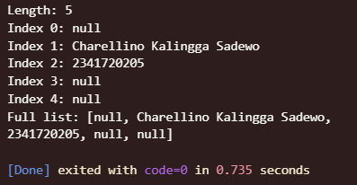

## 2. Praktikum 1: Eksperimen Tipe Data List
Selesaikan langkah-langkah praktikum berikut ini menggunakan VS Code atau Code Editor favorit Anda.

### Langkah 1:
Ketik atau salin kode program berikut ke dalam void main().

```dart
var list = [1, 2, 3];
assert(list.length == 3);
assert(list[1] == 2);
print(list.length);
print(list[1]);

list[1] = 1;
assert(list[1] == 1);
print(list[1]);
```
### Langkah 2:
Silakan coba eksekusi (Run) kode pada langkah 1 tersebut. Apa yang terjadi? Jelaskan!

#### Answer


Penjelasan:

1. print(list.length); → mencetak 3 (panjang list [1, 2, 3])
2. print(list[1]); → mencetak 2 (elemen pada index 1)
3. list[1] = 1; → mengubah elemen index 1 dari 2 menjadi 1
4. print(list[1]); → mencetak 1 (elemen index 1 setelah diubah)
Semua assert statements berjalan tanpa error karena kondisinya benar.

Langkah 3: Mod
### Langkah 3:
Ubah kode pada langkah 1 menjadi variabel final yang mempunyai index = 5 dengan default value = null. Isilah nama dan NIM Anda pada elemen index ke-1 dan ke-2. Lalu print dan capture hasilnya.

Apa yang terjadi ? Jika terjadi error, silakan perbaiki.

#### Answer


Penjelasan:

1. final variable: finalList dideklarasikan sebagai final (tidak bisa diubah referensinya)
2. index = 5: List memiliki 5 elemen (index 0-4)
3. default value = null: Semua elemen diinisialisasi dengan null
4. Nama di index 1: "Charellino Kalingga Sadewo"
5. NIM di index 2: "2341720205"
6. String?: Tipe data nullable string untuk mengakomodasi null values

## 3. Praktikum 2: Eksperimen Tipe Data Set
Selesaikan langkah-langkah praktikum berikut ini menggunakan VS Code atau Code Editor favorit Anda.

### Langkah 1:
Ketik atau salin kode program berikut ke dalam fungsi main().

```dart
var halogens = {'fluorine', 'chlorine', 'bromine', 'iodine', 'astatine'};
print(halogens);
```

### Langkah 2:
Silakan coba eksekusi (Run) kode pada langkah 1 tersebut. Apa yang terjadi? Jelaskan! Lalu perbaiki jika terjadi error.

### answer 

Deklarasi menggunakan {} dengan elemen langsung akan membuat sebuah Set di Dart.

### Langkah 3:
Tambahkan kode program berikut, lalu coba eksekusi (Run) kode Anda.

```dart
var names1 = <String>{};
Set<String> names2 = {}; // This works, too.
var names3 = {}; // Creates a map, not a set.

print(names1);
print(names2);
print(names3);
```

Apa yang terjadi ? Jika terjadi error, silakan perbaiki namun tetap menggunakan ketiga variabel tersebut. Tambahkan elemen nama dan NIM Anda pada kedua variabel Set tersebut dengan dua fungsi berbeda yaitu .add() dan .addAll(). Untuk variabel Map dihapus, nanti kita coba di praktikum selanjutnya.

#### Answer
* var names1 = <String>{}; → Set kosong bertipe String
* Set<String> names2 = {}; → Set kosong bertipe String
* var names3 = {}; → Map kosong, bukan Set!


Perbaikan & Penambahan
* Hapus penggunaan names3 (Map).
* Tambahkan nama dan NIM ke names1 dan names2 menggunakan .add() dan .addAll().


## 4. Praktikum 3: Eksperimen Tipe Data Maps
Selesaikan langkah-langkah praktikum berikut ini menggunakan VS Code atau Code Editor favorit Anda.

### Langkah 1:
Ketik atau salin kode program berikut ke dalam fungsi main().

```dart
var gifts = {
  // Key:    Value
  'first': 'partridge',
  'second': 'turtledoves',
  'fifth': 1
};

var nobleGases = {
  2: 'helium',
  10: 'neon',
  18: 2,
};

print(gifts);
print(nobleGases);
```

### Langkah 2:
Silakan coba eksekusi (Run) kode pada langkah 1 tersebut. Apa yang terjadi? Jelaskan! Lalu perbaiki jika terjadi error.

#### Answer 


* gifts is a Map with String keys and mixed value types (String and int).
* nobleGases is a Map with int keys and mixed value types (String and int).

Penjelasan:
Dart Map dapat berisi value dengan tipe berbeda jika tidak dideklarasikan secara spesifik. Namun, jika Anda ingin menggunakan Map dengan tipe tertentu (misal Map<String, String>), semua value harus bertipe String.

### Langkah 3:
Tambahkan kode program berikut, lalu coba eksekusi (Run) kode Anda.

```dart
var mhs1 = Map<String, String>();
gifts['first'] = 'partridge';
gifts['second'] = 'turtledoves';
gifts['fifth'] = 'golden rings';

var mhs2 = Map<int, String>();
nobleGases[2] = 'helium';
nobleGases[10] = 'neon';
nobleGases[18] = 'argon';
```
Apa yang terjadi ? Jika terjadi error, silakan perbaiki.

Tambahkan elemen nama dan NIM Anda pada tiap variabel di atas (gifts, nobleGases, mhs1, dan mhs2). Dokumentasikan hasilnya dan buat laporannya!

