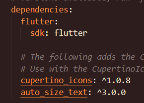
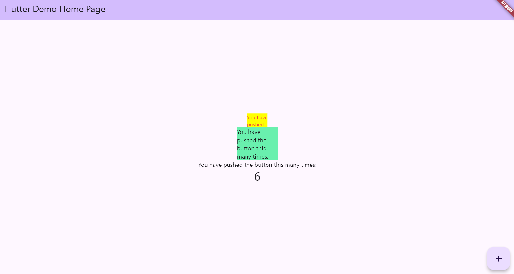

# Tugas Praktikum
## 1. Selesaikan Praktikum tersebut, lalu dokumentasikan dan push ke repository Anda berupa screenshot hasil pekerjaan beserta penjelasannya di file README.md!
Praktikum Menerapkan Plugin di Project Flutter
Selesaikan langkah-langkah praktikum berikut ini menggunakan editor Visual Studio Code (VS Code) atau Android Studio atau code editor lain kesukaan Anda.

Perhatian: Diasumsikan Anda telah berhasil melakukan setup environment Flutter SDK, VS Code, Flutter Plugin, dan Android SDK pada pertemuan pertama.

### Langkah 1: Buat Project Baru
Buatlah sebuah project flutter baru dengan nama flutter_plugin_pubdev. Lalu jadikan repository di GitHub Anda dengan nama flutter_plugin_pubdev.


### Langkah 2: Menambahkan Plugin
Tambahkan plugin auto_size_text menggunakan perintah berikut di terminal

flutter pub add auto_size_text
Jika berhasil, maka akan tampil nama plugin beserta versinya di file pubspec.yaml pada bagian dependencies.

### Langkah 3: Buat file red_text_widget.dart
Buat file baru bernama red_text_widget.dart di dalam folder lib lalu isi kode seperti berikut.
```dart
import 'package:flutter/material.dart';

class RedTextWidget extends StatelessWidget {
  const RedTextWidget({Key? key}) : super(key: key);

  @override
  Widget build(BuildContext context) {
    return Container();
  }
}
```
Langkah 4: Tambah Widget AutoSizeText
Masih di file red_text_widget.dart, untuk menggunakan plugin auto_size_text, ubahlah kode return Container() menjadi seperti berikut.
```dart
return AutoSizeText(
      text,
      style: const TextStyle(color: Colors.red, fontSize: 14),
      maxLines: 2,
      overflow: TextOverflow.ellipsis,
);
```
Setelah Anda menambahkan kode di atas, Anda akan mendapatkan info error. Mengapa demikian? Jelaskan dalam laporan praktikum Anda!

Langkah 5: Buat Variabel text dan parameter di constructor
Tambahkan variabel text dan parameter di constructor seperti berikut.
```dart
final String text;

const RedTextWidget({Key? key, required this.text}) : super(key: key);
Langkah 6: Tambahkan widget di main.dart
Buka file main.dart lalu tambahkan di dalam children: pada class _MyHomePageState

Container(
   color: Colors.yellowAccent,
   width: 50,
   child: const RedTextWidget(
             text: 'You have pushed the button this many times:',
          ),
),
Container(
    color: Colors.greenAccent,
    width: 100,
    child: const Text(
           'You have pushed the button this many times:',
          ),
),
```
Run aplikasi tersebut dengan tekan F5, maka hasilnya akan seperti berikut.



## 2. Jelaskan maksud dari langkah 2 pada praktikum tersebut!

**Jawaban:**

Langkah 2 bertujuan untuk menambahkan plugin `auto_size_text` ke dalam proyek Flutter. Perintah `flutter pub add auto_size_text` akan:

1. Mengunduh dan menginstal plugin `auto_size_text` versi `^3.0.0` dari pub.dev
2. Menambahkan dependency secara otomatis ke file `pubspec.yaml` pada bagian `dependencies:`
3. Memperbarui `pubspec.lock` dengan informasi versi yang tepat
4. Mengunduh semua dependensi yang diperlukan oleh plugin tersebut

Plugin `auto_size_text` berfungsi untuk membuat teks yang dapat menyesuaikan ukurannya secara otomatis berdasarkan ruang yang tersedia dalam container, sehingga mencegah overflow teks.

## 3. Jelaskan maksud dari langkah 5 pada praktikum tersebut!

**Jawaban:**

Langkah 5 bertujuan untuk membuat widget `RedTextWidget` menjadi reusable dan configurable dengan menambahkan:

1. **Variabel instance `text`**: 
   ```dart
   final String text;
   ```
   Menyimpan nilai teks yang akan ditampilkan oleh widget.

2. **Parameter constructor `required this.text`**:
   ```dart
   const RedTextWidget({super.key, required this.text});
   ```
   Memungkinkan parent widget untuk mengirimkan string teks saat membuat instance `RedTextWidget`.

Dengan langkah ini, widget menjadi lebih fleksibel karena dapat menerima teks yang berbeda-beda dari luar, bukan hanya menampilkan teks statis.

## 4. Pada langkah 6 terdapat dua widget yang ditambahkan, jelaskan fungsi dan perbedaannya!

**Jawaban:**

Pada langkah 6, ditambahkan dua Container dengan widget teks yang berbeda:

**Container Pertama (dengan RedTextWidget):**
```dart
Container(
  color: Colors.yellowAccent,
  width: 50,
  child: const RedTextWidget(
    text: 'You have pushed the button this many times:',
  ),
),
```
- **Fungsi**: Menampilkan teks menggunakan custom widget `RedTextWidget`
- **Fitur khusus**: 
  - Menggunakan `AutoSizeText` yang menyesuaikan ukuran font secara otomatis
  - Teks berwarna merah (sesuai implementasi di `RedTextWidget`)
  - Maksimal 2 baris dengan overflow ellipsis
  - Lebar container hanya 50 pixel

**Container Kedua (dengan Text biasa):**
```dart
Container(
  color: Colors.greenAccent,
  width: 100,
  child: const Text(
    'You have pushed the button this many times:',
  ),
),
```
- **Fungsi**: Menampilkan teks menggunakan widget `Text` standar Flutter
- **Fitur khusus**:
  - Menggunakan `Text` biasa tanpa auto-resize
  - Warna teks default (hitam)
  - Tidak ada pembatasan baris
  - Lebar container 100 pixel

**Perbedaan Utama:**
- `RedTextWidget` akan menyesuaikan ukuran font agar muat dalam ruang yang tersedia
- `Text` biasa akan overflow jika teks terlalu panjang untuk container

## 5. Jelaskan maksud dari tiap parameter yang ada di dalam plugin auto_size_text berdasarkan tautan pada dokumentasi ini !

**Jawaban:**

Berdasarkan implementasi yang ada di `red_text_widget.dart`, parameter yang digunakan dalam `AutoSizeText` adalah:

1. **`text` (parameter pertama/positional)**
   - **Maksud**: String yang akan ditampilkan
   - **Penggunaan**: `text` (variabel yang diterima dari constructor)

2. **`style: const TextStyle(color: Colors.red, fontSize: 14)`**
   - **Maksud**: Styling untuk teks (warna, ukuran font, dll.)
   - **Fungsi**: Mengatur warna menjadi merah dan ukuran font awal 14
   - **Catatan**: AutoSizeText akan menyesuaikan fontSize ini jika diperlukan

3. **`maxLines: 2`**
   - **Maksud**: Membatasi jumlah maksimal baris yang dapat ditampilkan
   - **Fungsi**: Teks hanya akan ditampilkan maksimal dalam 2 baris
   - **Efek**: Jika teks terlalu panjang, font akan diperkecil dulu, jika masih tidak muat baru dipotong

4. **`overflow: TextOverflow.ellipsis`**
   - **Maksud**: Menentukan cara menangani teks yang overflow
   - **Fungsi**: Menambahkan "..." di akhir teks jika teks terpotong
   - **Alternatif**: Bisa juga `TextOverflow.clip`, `TextOverflow.fade`, dll.

**Parameter tambahan yang sering digunakan (tidak ada di implementasi ini):**
- `minFontSize`: Ukuran font minimum yang diizinkan
- `maxFontSize`: Ukuran font maksimum yang diizinkan  
- `stepGranularity`: Langkah perubahan ukuran font
- `presetFontSizes`: Daftar ukuran font yang sudah ditentukan
- `group`: Untuk mengsinkronkan ukuran font antar beberapa AutoSizeText

## 6. Kumpulkan laporan praktikum Anda berupa link repository GitHub kepada dosen!